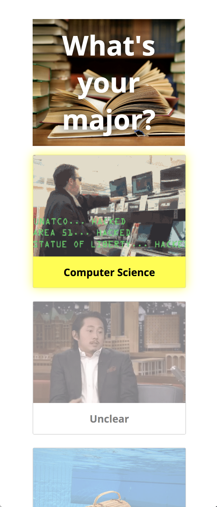
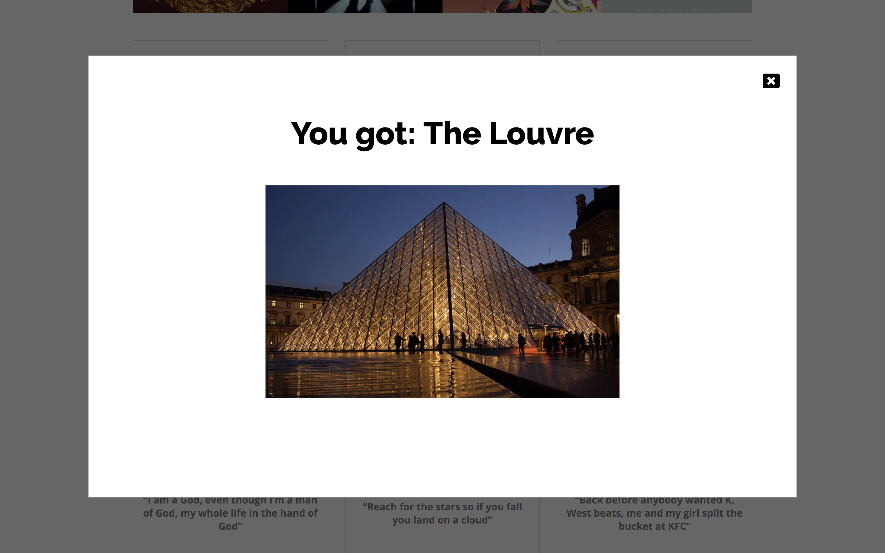

# Lab 2: Buzzfeed Quiz 📝

## Author 👩🏻‍💻
Sofia Stanescu-Bellu

## Which Parisian landmark are you? 🇫🇷

### Description
Ever wanted to know if you're more like the Eiffel Tower than Notre Dame? Now's your chance! My quiz determines which Parisian landmark is your spirit animal, errr spirit building?

### What worked
I had a lot of fun coming up with the content for this assignment and I think the styling worked pretty well overall. I'm definitely much more comfortable with CSS than I was after the first lab. Mobile responsiveness also went pretty well – it's surprising how responsive flex boxes are inherently and I only needed one `@media` query to make the website responsive.

### What didn't work so well
The Javascript/jQuery went pretty well for the most part, but getting the chosen radio box to change its state and getting the other, non-selected radio boxes to change their states as well was tricky. I had to play around with `.forEach()`, `.not()`, `.parent()`, and `.siblings()` to get everything working properly. Overlaying things was also a bit tricky – getting the `z-index` and positioning correctly took me awhile.

### Screencaps
Here's a demo of the selected and unselected states:

Here's a demo of mobile responsiveness:

And here's a demo of the result modal:

## Sources
* The French flag emoji transparency that I used for my icon was found [here](http://www.magic-emoji.com/)
* The images were all found on line and the links are found in their `img` tags.
* The Baudelaire quotes were obtained from [here](https://www.goodreads.com/author/quotes/13847.Charles_Baudelaire?page=1)
* Kanye quotes found [here](https://www.redbull.com/us-en/20-kanye-west-lyrics-you-can-use-every-day)
* The fonts used are the Google fonts [Open Sans](https://fonts.google.com/specimen/Open+Sans?selection.family=Open+Sans) and [Raleway](https://fonts.google.com/specimen/Raleway)
* A reference on the jQuery `.not()` function that I consulted is [here](http://api.jquery.com/not/)
* Toggling the yellow background color on and off was done by referencing nnnnnn's answer on [StackOverflow](https://stackoverflow.com/questions/45704842/changing-radio-button-background-on-selected-according-to-it-value)
* A reference on the `.forEach()` function that I consulted is [here](https://developer.mozilla.org/en-US/docs/Web/JavaScript/Reference/Global_Objects/Array/forEach)
* Referenced [w3schools' jQuery modal tutorial](https://www.w3schools.com/howto/howto_css_modals.asp) to create the response modal
* Overlaying the opacity div was done by referencing [this](https://stackoverflow.com/questions/2941189/how-to-overlay-one-div-over-another-div) Stack Overflow post
